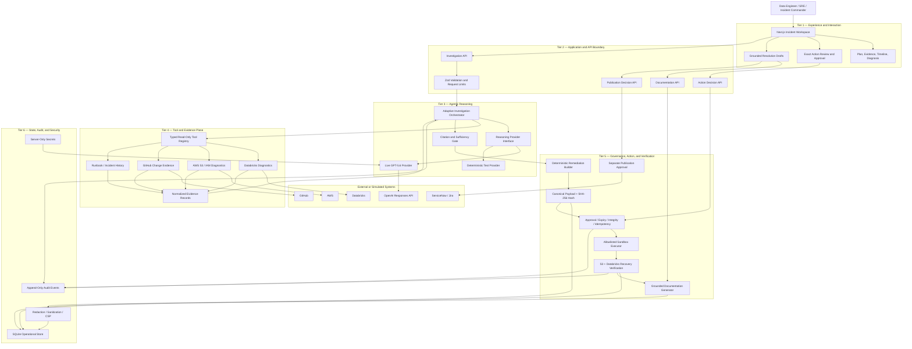
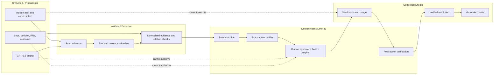
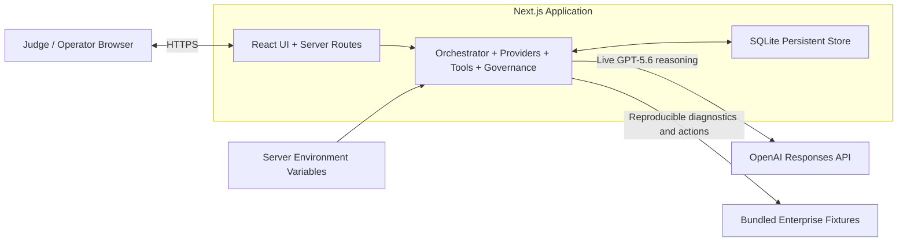

# OpsPilot AI

OpsPilot AI is an approval-gated digital engineer for enterprise data-platform incidents. It helps an on-call operator move from a failed pipeline to a cited diagnosis, governed remediation, verified recovery, and grounded operational documentation.

## OpenAI Build Week highlight

OpsPilot AI demonstrates a practical pattern for trustworthy enterprise agents: **GPT-5.6 owns reasoning, but it never owns authority**.

In the validated live workflow, GPT-5.6:

- creates a structured investigation plan;
- selects tools from a bounded read-only registry;
- assesses the initial Databricks, AWS, and runbook evidence;
- identifies that causal change history is still missing;
- adapts with targeted IAM and GitHub follow-up calls; and
- synthesizes ranked hypotheses using only persisted evidence citations.

Deterministic application code then constructs one exact remediation, binds human approval to the complete action using a SHA-256 hash, enforces expiry and idempotency, and closes the incident only after S3 access and the Databricks retry are verified. The journey continues through grounded ServiceNow, stakeholder, Jira, and incident-report drafts, each subject to a separate publication decision.

This is more than log summarization:

```text
Investigate → diagnose → propose → approve → act → verify → document
```

The project deliberately treats model output and tool results as evidence rather than authority. Logs, runbooks, repository content, and conversational input cannot grant permission, authorize remediation, or declare recovery.

## Problem and target user

When an enterprise data pipeline fails, the root cause is rarely visible in one place. An on-call data engineer must manually correlate job history and driver logs in Databricks, effective permissions and change history in AWS, infrastructure changes in GitHub, operational runbooks, and prior incidents. These systems expose fragments of the truth, not a unified explanation. The responder must determine which evidence is trustworthy, identify what changed, distinguish correlation from causation, choose the next diagnostic step, coordinate recovery, and communicate the outcome—while customers and downstream teams wait.

Traditional monitoring dashboards report symptoms. Search and chat assistants can summarize whichever log a user gives them, but they generally do not conduct a bounded investigation across systems, recognize when material evidence is missing, adapt the investigation, or prove that a proposed fix actually restored service. Fully autonomous agents introduce the opposite risk: model output, untrusted logs, or prompt-injection content could influence tool use or infrastructure changes without accountable human authorization.

OpsPilot AI solves this gap with a governed digital engineer powered by GPT-5.6. GPT-5.6 turns a high-level incident into a structured investigation plan, selects allowlisted read-only tools, evaluates the evidence collected from multiple systems, identifies causal gaps, requests targeted follow-up evidence, and produces ranked root-cause hypotheses with explicit citations. This reduces the responder's cognitive load and transforms disconnected operational records into a coherent, reviewable diagnosis.

The project deliberately does not give GPT-5.6 unrestricted authority. Deterministic policy code validates every model-selected tool, constructs the exact remediation, binds human approval to its complete SHA-256 hash, prevents duplicate execution, and requires post-action evidence before declaring recovery. Once recovery is verified, OpsPilot generates grounded technical and stakeholder drafts from the persisted record.

The result is a complete incident-response loop:

```text
Fragmented signals → adaptive GPT-5.6 investigation → cited diagnosis
→ human-governed remediation → verified recovery → grounded follow-up
```

OpsPilot targets data-platform engineers, SRE teams, and incident commanders who need to reduce time-to-diagnosis and coordination effort without surrendering control, auditability, or safety to the model.

## Product journey

1. Start the seeded Customer360 incident.
2. GPT-5.6-compatible reasoning creates a structured plan and selects allowlisted read tools.
3. The investigator identifies an evidence gap, adapts its tool calls, and synthesizes cited hypotheses.
4. Deterministic code proposes one exact remediation and binds approval to its SHA-256 hash.
5. The approved sandbox action restores simulated access, verifies S3 access, and retries the simulated Databricks job.
6. Only after verified recovery, the system generates ServiceNow, stakeholder, Jira, and incident-report drafts.
7. Every external draft requires a separate operator decision. Connectors are intentionally not configured.

## Architecture

The governing design principle is:

> **GPT-5.6 owns investigation reasoning; deterministic application controls own authority, execution, verification, and closure.**

This separation allows the model to investigate adaptively without allowing probabilistic output, untrusted logs, repository content, or conversational input to authorize an infrastructure change.

### Tiered component architecture



### Tier responsibilities

| Tier | Components | Responsibility and interaction |
|---|---|---|
| **1. Experience** | Incident workspace, investigation timeline, evidence explorer, diagnosis, approval panel, documentation workspace | Gives the operator one visible journey from incident intake to verified recovery. It sends requests to server APIs but cannot call tools or approve actions implicitly. |
| **2. Application/API** | Next.js route handlers, Zod schemas, request limits | Forms the trusted server boundary. It validates every request and delegates investigation, decisions, and documentation to the appropriate service. |
| **3. Agentic reasoning** | Adaptive orchestrator, GPT-5.6 provider, deterministic provider, citation gate | GPT-5.6 plans the investigation, selects allowlisted read tools, evaluates sufficiency, gathers more evidence when needed, and synthesizes cited hypotheses. The orchestrator validates every tool request and citation. |
| **4. Tool/evidence plane** | Typed registry, Databricks, AWS, GitHub, runbook, and incident-history adapters | Executes bounded read-only diagnostics and converts heterogeneous results into normalized evidence records. Tool output is treated as untrusted evidence, never as authority. |
| **5. Governance/action** | Remediation builder, canonical hash, approval policy, executor, verification, document generator | Deterministic code builds the exact action. A human decision must match its hash and expiry. Execution is idempotent, and closure requires successful S3 and Databricks verification. Publication has a separate approval. |
| **6. State/security** | SQLite, audit events, redaction, sanitization, CSP, environment secrets | Persists the investigation and authorization record, protects credentials, records transitions, and prevents sensitive or unsafe content from reaching the UI or generated documents. |

### Agentic investigation and closed-loop action

```mermaid
sequenceDiagram
    autonumber
    actor Operator
    participant UI as Incident Workspace
    participant Orch as Adaptive Orchestrator
    participant GPT as GPT-5.6
    participant Tools as Read-Only Tools
    participant Gov as Governance
    participant Exec as Sandbox Executor
    participant Store as SQLite / Audit

    Operator->>UI: Start investigation
    UI->>Orch: Validated incident request
    Orch->>GPT: Plan using bounded tools and resources
    GPT-->>Orch: Structured initial plan
    Orch->>Tools: Gather Databricks, S3, IAM, and runbook evidence
    Tools-->>Orch: Normalized evidence records
    Orch->>GPT: Assess evidence sufficiency
    GPT-->>Orch: gather_more — request IAM history and GitHub changes
    Orch->>Tools: Execute allowlisted follow-up calls
    Tools-->>Orch: Causal change evidence
    Orch->>GPT: Synthesize ranked, cited hypotheses
    GPT-->>Orch: Diagnosis and evidence IDs
    Orch->>Gov: Validated synthesis
    Gov->>Store: Persist exact proposal and SHA-256 hash
    Gov-->>UI: Show action, risk, rollback, expiry, and hash
    Operator->>UI: Approve exact action
    UI->>Gov: Decision + stored action hash
    Gov->>Gov: Recompute integrity; check expiry and idempotency
    Gov->>Exec: Execute once
    Exec->>Exec: Restore simulated access
    Exec->>Exec: Verify S3 and retry Databricks job
    Exec->>Store: Persist verified outcome and audit event
    Store-->>UI: Recovery verified; enable grounded drafts
```

The live validated reasoning path is:

```text
initial plan → collect initial evidence → detect causal gap
→ gather_more → select IAM history and GitHub change tools
→ synthesize cited hypotheses → deterministic proposal
→ human approval → execute → verify → document
```

### Trust boundaries and authority



Only the solid path can produce an effect. The dashed paths document explicitly denied authority relationships.

### Deployment topology



### Live versus simulated components

| Capability | Current implementation |
|---|---|
| GPT-5.6 planning, assessment, adaptation, and synthesis | **Live OpenAI Responses API**, validated end to end |
| Credential-free judging and automated tests | Deterministic provider implementing the same reasoning interface |
| Databricks, AWS, and GitHub diagnostics | Realistic typed fixture adapters; no production credentials required |
| IAM remediation and Databricks retry | Deterministic sandbox action with post-action verification |
| ServiceNow and Jira | Grounded drafts plus separate publication decisions; outbound connectors intentionally not configured |

The detailed standalone version remains available in [Architecture](outputs/opspilot-architecture.md), including the source-code component map.

## GPT-5.6 usage

GPT-5.6 is responsible for the agentic reasoning work: planning the investigation, selecting tools within an allowlist, assessing collected evidence, adapting when evidence is missing, and synthesizing ranked, cited hypotheses. It cannot approve actions, expand permissions, directly execute writes, or mark an incident resolved. A real GPT-5.6 Responses API run was validated end to end with the visible `gather_more → synthesize` sequence. The repository also includes a deterministic GPT-5.6-compatible provider so judges can reproduce the complete flow without credentials.

## How Codex materially built the system

Codex translated the business requirements and threat model into the staged architecture, implemented the typed contracts and UI, created the simulated multi-system adapters, separated model reasoning from deterministic governance, added hash-bound approval and idempotent execution, diagnosed SQLite build concurrency, and built unit/component/browser tests. During real GPT-5.6 validation, Codex also diagnosed and corrected strict JSON Schema incompatibility, insufficient request timeout, missing allowlisted resource context, initial-versus-adaptive tool separation, duplicate evidence calls, and executable task-contract mismatches. The included implementation plan records how these decisions map to judging criteria. Add the final Codex `/feedback` Session ID to the submission form after completing the project session.

## Run locally

Requirements: Node.js 24 LTS.

```powershell
npm ci
npm run dev
```

Open `http://localhost:3000`. No credentials are required in deterministic mode. Use **Reset demo** to return to a clean incident state.

One-command container option:

```powershell
docker compose up --build
```

## Optional live GPT-5.6 reasoning

Copy `.env.example` to `.env.local`, set `OPSPILOT_REASONING_MODE=live`, add a server-side `OPENAI_API_KEY`, and configure the hackathon-approved GPT-5.6 model identifier. Live mode fails closed if configuration is absent; it does not silently fall back. Never commit `.env.local`.

## Testing and evaluation

```powershell
npm run lint
npm run typecheck
npm run test
npm run build
npm run test:ui
```

Tests cover strict schemas, redaction, tool allowlisting, evidence normalization, adaptive reasoning, citation grounding, action hashing, approval/rejection, verified closure, documentation grounding, responsive desktop/mobile behavior, and security headers.

## Security model

- Model output and tool evidence are untrusted data.
- Only registered tools with strict inputs can run.
- Read and write paths are separated.
- Conversation cannot invoke remediation or publication.
- Approval is bound to the canonical action payload and expires after 15 minutes.
- Persisted action integrity is recomputed server-side.
- Execution is idempotent and closure requires successful verification.
- Documentation loads only persisted verified data, removes executable markup/links, and redacts common secrets and account identifiers.
- External records remain drafts until separately approved.
- Secrets remain server-side and `.env*` is ignored except `.env.example`.

## Simulated versus live integrations

GPT-5.6 reasoning has been validated live through the OpenAI Responses API. The Databricks, AWS, GitHub, ServiceNow, and Jira behaviors use realistic sandbox fixtures and do not read or mutate real external systems. The reproducible automated suite uses deterministic reasoning to avoid credentials, cost, and model variance. Databricks AI Dev Kit/skills were considered in the architecture but are not bundled or claimed as a runtime dependency in this build.

## Limitations

- Single seeded incident and single demo operator; no production authentication or RBAC.
- No real AWS/Databricks writes or external ServiceNow/Jira posting.
- Rollback execution, partial-failure injection, historical similarity retrieval, and investigation replay remain future work.
- The demo SQLite store is local and not suitable for multi-instance production deployment.
- A judge-accessible hosted URL, demo video, and Codex Session ID require manual owner actions before submission.

## Submission resources

- [Business requirements](outputs/opspilot-business-requirements.md)
- [Implementation plan](outputs/opspilot-implementation-plan.md)
- [Demo script](outputs/stage-6-demo-script.md)
- [Security and evaluation report](outputs/stage-6-security-evaluation.md)
- [Live GPT-5.6 validation evidence](outputs/live-gpt-5-6-validation.md)
- [Judging criteria evidence](outputs/judging-criteria-evidence.md)
- [Submission checklist](outputs/stage-6-submission-checklist.md)

Licensed under the MIT License.
