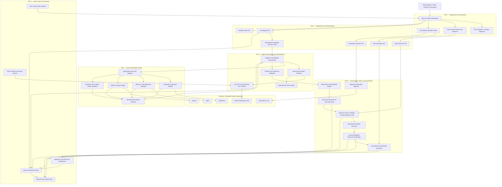
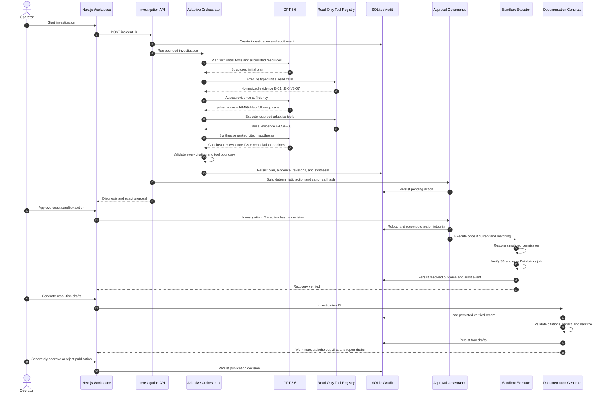
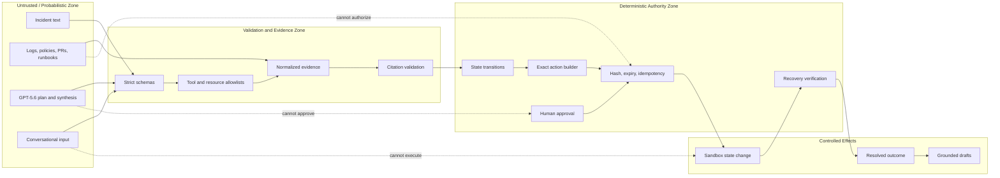
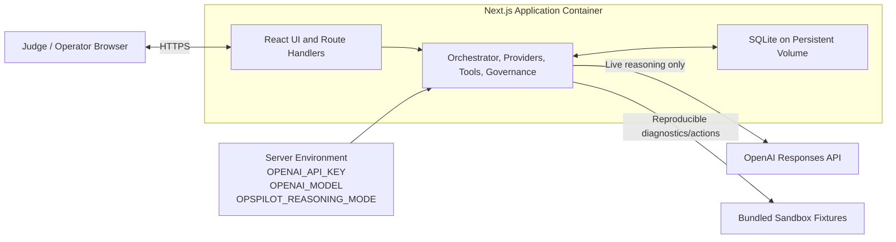

# OpsPilot AI Architecture

## 1. Architectural intent

OpsPilot AI is designed around one governing principle:

> **GPT-5.6 owns investigation reasoning; deterministic application controls own authority, execution, and closure.**

The system separates probabilistic reasoning from security-sensitive decisions. GPT-5.6 can plan, select bounded diagnostic tools, identify evidence gaps, and synthesize cited hypotheses. It cannot grant itself permission, construct arbitrary write actions, approve remediation, execute external changes, or declare an incident resolved.

## 2. Layered component architecture



## 3. Tier responsibilities

### Tier 1 — Experience and interaction

The browser presents a structured incident workspace rather than a chat-only interface.

| Component | Responsibility |
|---|---|
| Incident workspace | Starts an investigation and shows the seeded incident context. |
| Plan and timeline | Makes GPT-5.6 planning and adaptive decisions visible to the operator. |
| Evidence explorer | Shows evidence source, reliability, sensitivity, summary, and reference. |
| Diagnosis view | Displays ranked hypotheses and clickable evidence citations. |
| Approval panel | Shows the exact target, resource, risk, rollback, expiry, and action hash. |
| Documentation workspace | Displays four grounded drafts and their publication decisions. |

Conversational input is supplementary. It cannot call tools, approve remediation, or bypass state transitions.

### Tier 2 — Application and API boundary

Next.js route handlers provide the trusted server boundary.

| API | Purpose | Security behavior |
|---|---|---|
| `POST /api/investigations` | Starts planning, evidence collection, adaptation, and synthesis. | Strict input schema, incident allowlist, sanitized error response. |
| `POST /api/actions/decision` | Approves or rejects the stored remediation. | Requires investigation ID, exact action hash, and explicit decision. |
| `POST /api/documentation` | Generates grounded drafts after verified recovery. | Loads persisted verified facts rather than browser/model context. |
| `POST /api/documentation/decision` | Records a separate outbound-document decision. | Publication approval is distinct from remediation approval. |
| `POST /api/demo/reset` | Resets sandbox state for a reproducible demo. | Requires an explicit confirmation literal; production hardening still requires authentication. |

Zod schemas reject malformed, unknown, over-posted, or structurally unsafe requests.

### Tier 3 — Agentic reasoning and orchestration

The orchestrator coordinates GPT-5.6 but does not delegate security policy to it.

GPT-5.6 performs three bounded reasoning operations:

1. **Plan:** create an initial investigation using only the supplied read tools and allowlisted sandbox identifiers.
2. **Assess:** determine whether evidence is sufficient, should be expanded, or must be escalated.
3. **Synthesize:** rank hypotheses and produce a conclusion citing only available evidence IDs.

The live validated sequence is:

```text
Initial plan
  → collect Databricks, S3, IAM, and runbook evidence
  → GPT-5.6 detects missing causal history
  → gather_more
  → select IAM history and GitHub change tools
  → synthesize
```

The deterministic provider implements the same interface for reproducible tests without API credentials or model variance.

### Tier 4 — Tool and evidence plane

The tool registry is the only path from reasoning to diagnostic systems.

Every registered tool has:

- a unique allowlisted name;
- a strict input schema;
- read-only classification;
- bounded timeout;
- bounded result size;
- deterministic resource restrictions; and
- normalized evidence output.

The model cannot dynamically create a tool or execute an unregistered name. Each simulated adapter represents one bounded source snapshot, so execution is idempotent by tool name inside an investigation.

Evidence is normalized into a common contract:

```text
evidence ID + source system + source type + observed time
+ title + summary + raw reference + reliability + sensitivity
+ related task + simulation label + structured attributes
```

Tool output remains untrusted evidence. Content inside a log, runbook, pull request, or historical incident cannot modify policy or authorize an action.

### Tier 5 — Governance, action, and verification

This tier creates the separation between reasoning and authority.

The remediation builder is deterministic. It creates an allowlisted sandbox action containing:

- exact tool and arguments;
- target resource;
- expected result;
- risk;
- preconditions;
- rollback instructions;
- verification steps;
- expiration; and
- SHA-256 hash of the canonical action payload.

The decision service reloads the stored action and recomputes integrity. Execution is permitted only when the submitted hash matches the stored column and canonical payload, the approval window is current, and no outcome already exists.

The executor returns an idempotent sandbox outcome. The incident becomes resolved only when both checks pass:

```text
S3 access verified = true
Databricks retry status = SUCCESS
```

Documentation is downstream of verified recovery. Drafts are generated only from persisted incident facts, cited synthesis, evidence, and action outcome. A remediation approval never implies permission to publish an external record.

### Tier 6 — State, audit, and security

SQLite stores incidents, investigations, tasks, evidence, reasoning results, remediation actions, outcomes, documentation bundles, publication decisions, and audit events.

Security controls span all tiers:

- server-side secrets loaded from `.env.local`;
- no credential returned to the browser;
- strict schemas and content-length limits;
- untrusted-evidence handling;
- evidence-citation validation;
- read/write tool separation;
- canonical action hashing;
- approval expiry and idempotency;
- sanitization and secret-pattern redaction;
- Content Security Policy and browser security headers; and
- transparent labeling of simulated external data.

## 4. End-to-end interaction sequence



## 5. Trust boundaries and authority flow



The solid path is the only valid authority path. Dashed relationships are explicitly denied.

## 6. Deployment topology



The public hackathon deployment should use deterministic fixtures for enterprise systems and a server-side OpenAI key for the live reasoning demonstration. No real enterprise credential or production cloud write permission is required.

## 7. Source-code component map

| Path | Architectural role |
|---|---|
| `src/app` | UI composition and server API routes |
| `src/components` | Operator incident workspace |
| `src/domain` | Zod domain contracts and state machine |
| `src/reasoning` | GPT-5.6 and deterministic provider implementations |
| `src/orchestration` | Planning, tool execution, adaptation, citation enforcement |
| `src/tools` | Registry, adapters, allowlisted fixtures |
| `src/actions` | Canonical remediation and cryptographic hashing |
| `src/documentation` | Verified-record document generation and sanitization |
| `src/security` | Recursive sensitive-field redaction |
| `src/db` | SQLite initialization, persistence, outcomes, and audit records |
| `tests/e2e` | Desktop/mobile full-product validation |

## 8. What is live versus simulated

| Capability | Implementation |
|---|---|
| GPT-5.6 planning, assessment, adaptation, synthesis | Live OpenAI Responses API; separately validated end to end |
| Deterministic reasoning | Credential-free reproducible test provider |
| Databricks diagnostics | Realistic simulated fixture adapter |
| AWS S3/IAM diagnostics | Realistic simulated fixture adapters |
| GitHub change evidence | Realistic simulated fixture adapter |
| IAM remediation and job retry | Deterministic sandbox execution |
| ServiceNow/Jira creation | Draft and approval flow only; connector not configured |

This separation is intentional: the hackathon demonstrates substantive live GPT-5.6 reasoning and safe enterprise-agent architecture without requiring judges to grant real infrastructure access.
